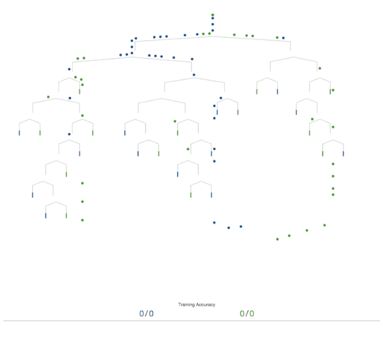
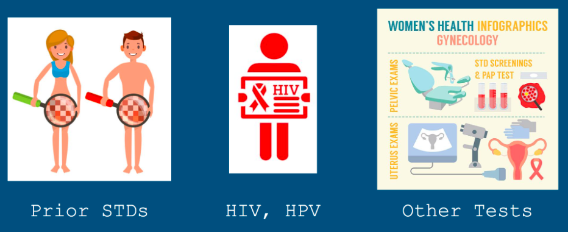

# Cervical Cancer Risk Factor Analysis and Classification

## Introduction

In the following project, we analyze the data with a focus on which risk factors appear to most significantly lead to positive biopsies for cervical cancer. Additionally, we aim to identify a model that most effectively classifies cases of cervical cancer based upon these risk factors. To achieve these goals, we will employ the OSEMN (obtain, scrub, explore, model, and analyze) data science model

The data utilized throughout this project was obtained from medical records of 858 women in Caracas, Venezuela at Hospital Universitario de Caracas.

## Objectives

Throughout this project we will aim to answer the following questions through exploratory analysis and machine learning:
* What risk factors most significantly correlate with positive biopsies for cervical cancer?
* Which classification model performs most accurately while minimizing false negatives?

## Process

Across the scope of the project, we touch upon various components of our data science process, depending on the research question at hand. However, the overall project from start to finish adheres to the OSEMN framework:

1. Obtain
2. Scrub
3. Explore
4. Model
5. Interpret

## Summary

Based on our modeling results, the optimal model for further use was the decision tree classifier with parameters specified by utilizing GridSearch. While other models performed well, oftentimes with high levels of accuracy, or especially low counts of false negatives, this decision tree model performed with perfect accuracy with 0 counts of both false negatives and false positives.

Other noteable models included the logistic regression classifiers developed using PCA-transformed data, with particularly high recall compared to most other models. Within the context of cancer classification, minimizing false negatives is highly prioritized, even over minimizing false positives. While receiving a positive diagnosis when you do not actually have cancer can be difficult emotionally, this results is much more preferred than a false negative which indicates a missed diagnosis for someone that actually has cancer and thus, will not receive treatment.

In our exploration of the data prior to modeling, we discovered the following with regards to indications about the likelihood of cervical cancer:
* The presence of IUDs, STDs, STDs: HIV, STDs: vulvo-perineal condylomatosis led to much higher likelihoods of positive biopsies.
* The most impactful STD appears to be HIV. Women positive for HIV were over 18% more likely to be positive for the biopsy.
* Prior diagnoses with certain dieases increased the likelihood of a cervical cancer diagnosis significantly: 35% for prior cancer, 36% for CIN, 32% for HPV.
* Of our other methods potentially indicative of a cervical cancer diagnosis, Hinselmann and Schiller appear most correlated with our target, with 68% and 62% (respectively) of positive diagnoses also positive under the biopsy. Citology appears to be less accurate, with only 43% of positive cases also positive for the biopsy.
* Smokers and women with IUDs are 4.1% more likely to have a positive cancer diagnosis.
* The one woman with genital herpes was positive for the biopsy.
* No positive cases exist for the following self-reported STDs: cervical condylomatosis, pelvic inflammatory disease, AIDS, and HPV.

Based on the top risk factors identified above, our recommendations for best approaching cervical cancer diagnoses are as follows:
* Increased HIV and HPV prevention measures
* Proactive STD testing and treatment
* Regular testing for susceptible women (based on the history of highest priority risk factors identified)
* Thorough medical screening for these risk factors

While Schiller and Hinselmann emerged as top predictors in nearly every test we ran, this data may not always be available as an initial variable for predictive use. Thus, future work involves the following:
* Perform a multiclass classification model and analysis with 'Hinselmann', 'Schiller', 'Citology', and 'Biopsy' all utilized as target variables.
* Compare models for classification between Hinselmann, Schiller, Citology, and Biopsy, with each as a separate target variable.
* Create classification models for Biopsy in the absence of the other three diagnoses.

Additionally, this dataset draws upon patients solely in Venezuela, where the particular patient care and hospital conditions may lead to the significance of certain factors over others, that may be different than in other countries. In future work, it would be ideal to pull data from other Latin American and South American countries to see what similarities and differences exist, as well as to perform comparsion against data from other parts of the world as well, such as the United States, Europe, Africa, etc. Without a greater diversity of data, it will prove difficult to extend our findings for use in any greater medical context.